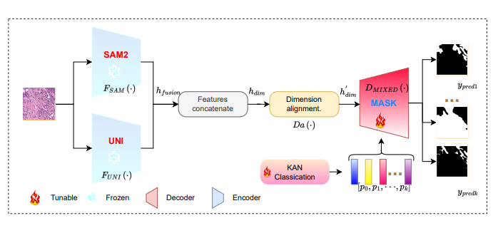

## SAM2-PATH: A better segment anything model for semantic segmentation in digital pathology

This is the official code repository for "SAM2-PATH: A better segment anything model for semantic segmentation in digital pathology
". [arxiv](https://arxiv.org/abs/2408.03651)

This work is based the SAM-PATH [Miccai conference paper](https://link.springer.com/chapter/10.1007/978-3-031-47401-9_16) and SAM2 [code](https://link.springer.com/chapter/10.1007/978-3-031-47401-9_16)

This code is adjusted from SAM-PATH [git link](https://github.com/cvlab-stonybrook/SAMPath)
and UNI encoder [git link](https://github.com/mahmoodlab/UNI)

All UNI and SAM2 pretrained weights can be download from their repos and Thanks for their base code