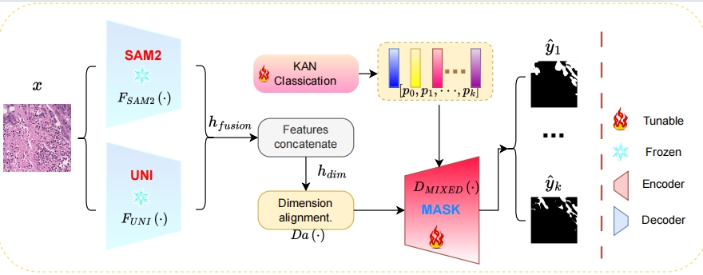

## Path-SAM2: Transfer SAM2 for digital pathology semantic segmentation

    

This is the official code repository for "SAM2-PATH: A better segment anything model for semantic segmentation in digital pathology
". [arxiv](https://arxiv.org/abs/2408.03651)